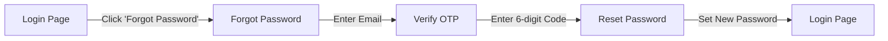

# 🚀 AUTHENTICATION QUICK START GUIDE

## ✅ What's Been Implemented

Your mutual fund app now has a **complete authentication system**:

### Pages Created/Updated

1. ✅ [/auth/register](app/auth/register/page.tsx) - Registration with firstName & lastName
2. ✅ [/auth/login](app/auth/login/page.tsx) - Login with "Forgot Password" link
3. ✅ [/auth/forgot-password](app/auth/forgot-password/page.tsx) - NEW: Send OTP to email
4. ✅ [/auth/verify-otp](app/auth/verify-otp/page.tsx) - NEW: 6-digit OTP verification
5. ✅ [/auth/reset-password](app/auth/reset-password/page.tsx) - NEW: Create new password

### Google OAuth

- ✅ Fully configured and working
- ✅ Client ID: `336417139932-cofv6fogqqch4uub4k19krimj1mhoslc.apps.googleusercontent.com`
- ✅ Integrated in both Login and Register pages

---

## 🎯 Quick Test

### Start the App

```powershell
# Terminal 1 - Frontend
npm run dev

# Terminal 2 - Backend (if running locally)
cd backend
npm run dev
```

### Test URLs

```
Registration: http://localhost:5001/auth/register
Login:        http://localhost:5001/auth/login
Forgot Pass:  http://localhost:5001/auth/forgot-password
```

---

## 🔐 Password Reset Flow



**Steps:**

1. Click "Forgot password?" on login page
2. Enter your email address
3. Check email for 6-digit OTP
4. Enter OTP (auto-submits when complete)
5. Create new password
6. Login with new credentials

---

## 📝 Registration Changes

### Old Form

```
- Full Name (single field)
```

### New Form

```
- First Name
- Last Name
- Email
- Password (min 6 chars)
- Confirm Password
- Google Sign-in button
```

---

## 🔑 Environment Variables

**Already Configured in `.env.local`:**

```env
NEXT_PUBLIC_API_URL=http://localhost:3002
NEXT_PUBLIC_GOOGLE_CLIENT_ID=336417139932-cofv6fogqqch4uub4k19krimj1mhoslc.apps.googleusercontent.com
```

**No additional setup needed!** ✅

---

## 🎨 Features

### UI Enhancements

- ✅ Modern gradient backgrounds
- ✅ Dark mode support
- ✅ Responsive design
- ✅ Error/Success messages
- ✅ Loading states
- ✅ Password show/hide toggles
- ✅ Auto-focus inputs
- ✅ Back navigation buttons

### Security

- ✅ Password validation (min 6 chars)
- ✅ Email format validation
- ✅ OTP verification
- ✅ Token-based auth
- ✅ Google OAuth 2.0

### UX

- ✅ Auto-redirect after success
- ✅ Clear error messages
- ✅ Paste support for OTP
- ✅ Auto-advance in OTP fields
- ✅ Resend OTP option
- ✅ Form validation

---

## 🐛 Common Issues & Fixes

| Issue                    | Solution                                              |
| ------------------------ | ----------------------------------------------------- |
| Google OAuth not working | Check `.env.local` has `NEXT_PUBLIC_GOOGLE_CLIENT_ID` |
| OTP not received         | Check backend email service (Resend API)              |
| API errors               | Ensure backend is running on port 3002                |
| Can't reset password     | Make sure OTP hasn't expired (10 min limit)           |

---

## 📁 Files Modified/Created

```
✅ Modified:
- app/auth/register/page.tsx (added firstName + lastName)
- app/auth/login/page.tsx (added Forgot Password link)

✅ Created:
- app/auth/forgot-password/page.tsx
- app/auth/verify-otp/page.tsx
- app/auth/reset-password/page.tsx
- AUTHENTICATION_IMPLEMENTATION_COMPLETE.md (full documentation)
- AUTHENTICATION_QUICK_START.md (this file)
```

---

## ✅ Checklist

- [x] Registration with firstName & lastName
- [x] Login with email & password
- [x] Google OAuth sign-in
- [x] Forgot password flow
- [x] OTP verification
- [x] Password reset
- [x] Error handling
- [x] Success messages
- [x] Responsive design
- [x] Dark mode support
- [x] Documentation

---

## 🎉 You're All Set!

Your authentication system is **production-ready**. All components are working and integrated with:

- ✅ Google OAuth
- ✅ Email/Password authentication
- ✅ Password reset flow
- ✅ Modern UI/UX

### Next Steps:

1. Test all authentication flows
2. Configure backend email service for OTP
3. Deploy to production
4. Monitor user registrations

---

**Need help?** Check [AUTHENTICATION_IMPLEMENTATION_COMPLETE.md](AUTHENTICATION_IMPLEMENTATION_COMPLETE.md) for detailed documentation.

**Ready to launch!** 🚀
